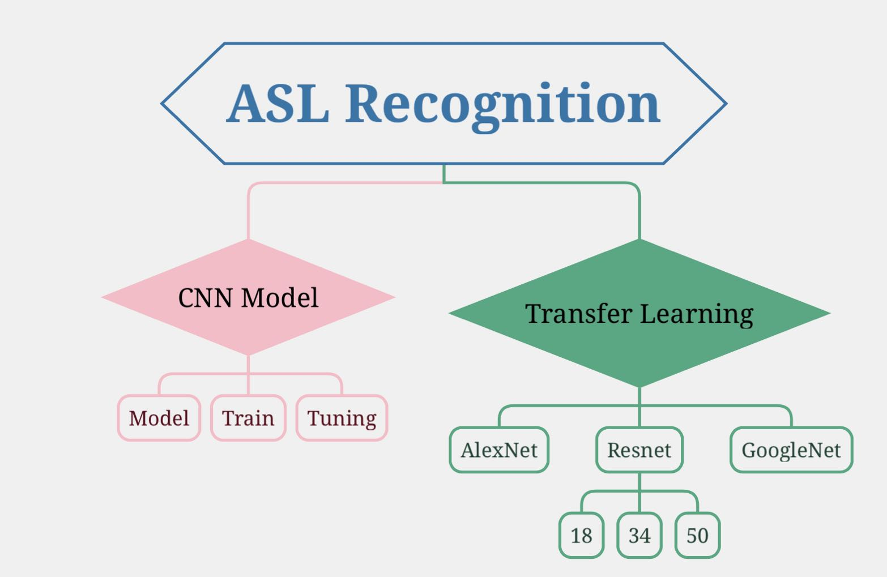
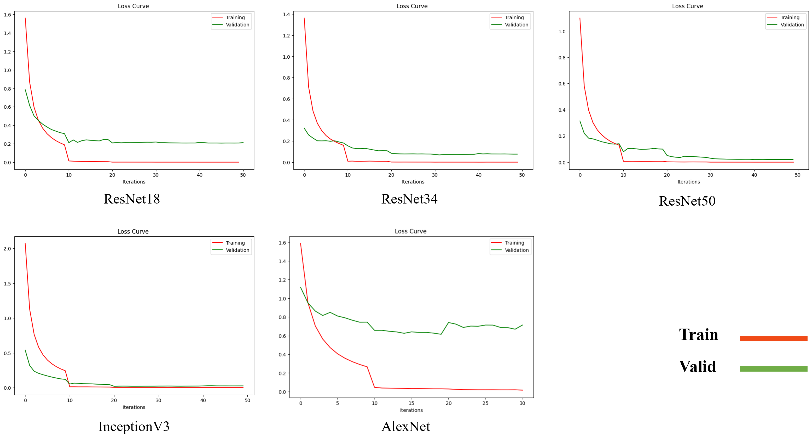
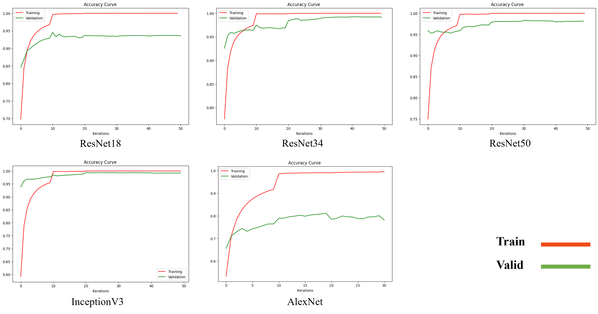

# EE541-Final Project-Group2
## CV for American Sign Language
###### Authors: Tingting Fang, Yilin Hou
## Models

## Structure
`Data`: The dataset of American sign language letters in real scenes that we made, includes 29 classes with 6 images per class.
`transfer learning`: Jupiter Notebook for data preprocessing and training transfer learning models.
`CNN`: Jupiter Notebook for data preprocessing and training CNN.
`model`: Trained models.
`image`: Images for `README.md`.
## Results
### Trandfer Learning
* Loss curve for Trainng

* Accuracy curve for Trainng

* Results on testing set

|           | AlexNet  | ResNet18   | ResNet34  | ResNet50  | InceptionV3|
|-----------|----------|------------|-----------|-----------|------------|
|Image Size |224 * 224 | &224 * 224 |	224 * 224 |	224 * 224 | 200 * 200  |
|Loss       |0.4185	   |0.1398	    |0.0577	    |0.1143	    |0.0565	     | 
|Accuracy   |88.023%   |95.690%     |98.345%    |97.621%	  |98.414%	   | 

* Results on real-senarios

|           | ResNet18   | ResNet34  | ResNet50  | InceptionV3|
|-----------|------------|-----------|-----------|------------|
|Image Size | &224 * 224 |	224 * 224 |	224 * 224 | 200 * 200  |
|Loss       |0.8208	     |0.7660      |0.8655	    |1.3397	     | 
|Accuracy   |76.687%     |80.368%     |76.074%	  |84.663%     |
## Data

[dataset from Kaggle](https://www.kaggle.com/datasets/grassknoted/asl-alphabet/)

  The dataset comprises a collection of images representing alphabets from the American Sign Language, organized into 29 folders corresponding to distinct classes. The dataset size is 1.0GB.
  
  The dataset dataset consists of 87,000 images, each sized at 200x200 pixels. It encompasses 29 classes, including 26 classes for the letters A-Z, along with 3 additional classes designated for SPACE, DELETE, and NOTHING. 
## References

* B. Alsharif, A. S. Altaher, A. Altaher, M. Ilyas, and E. Alalwany, “Deep learning technology to recognize american sign language alphabet,” vol. 23, no. 18, p. 7970, 2023.
* Y. Ma, T. Xu, and K. Kim, “Two-stream mixed convolutional neural network for American sign language recognition,” vol. 22, no. 16, p. 5959, 2022.
* He, K., Zhang, X., Ren, S., \& Sun, J. (2016). Deep residual learning for image recognition. In Proceedings of the IEEE conference on computer vision and pattern recognition (pp. 770-778).
* Szegedy, C., Vanhoucke, V., Ioffe, S., Shlens, J., \& Wojna, Z. (2016). Rethinking the inception architecture for computer vision. In Proceedings of the IEEE conference on computer vision and pattern recognition (pp. 2818-2826).
* Krizhevsky, A., Sutskever, I., \& Hinton, G. E. (2012). Imagenet classification with deep convolutional neural networks. Advances in neural information processing systems, 25.
